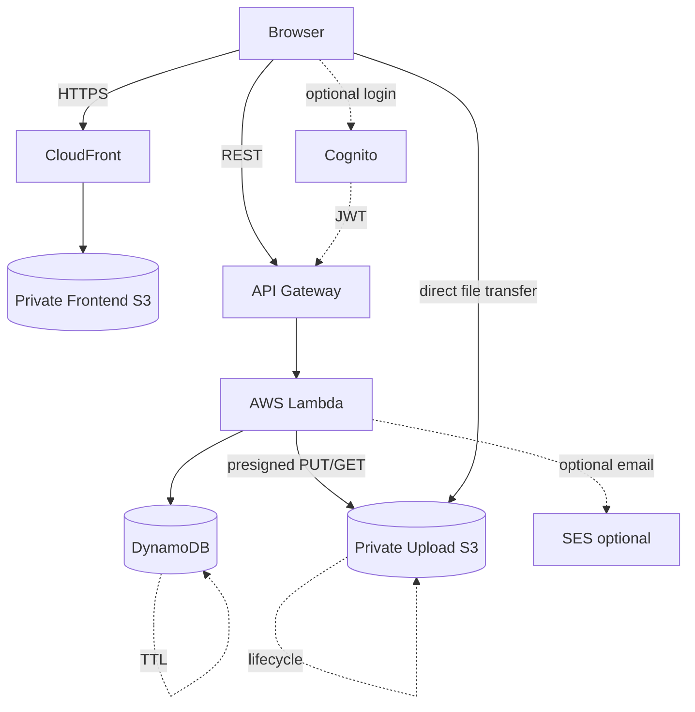
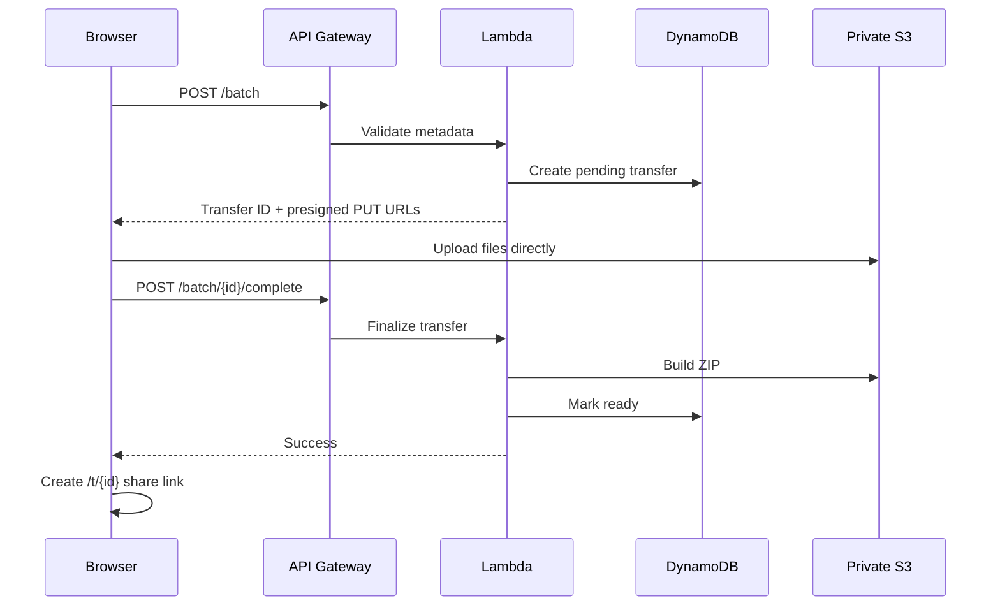
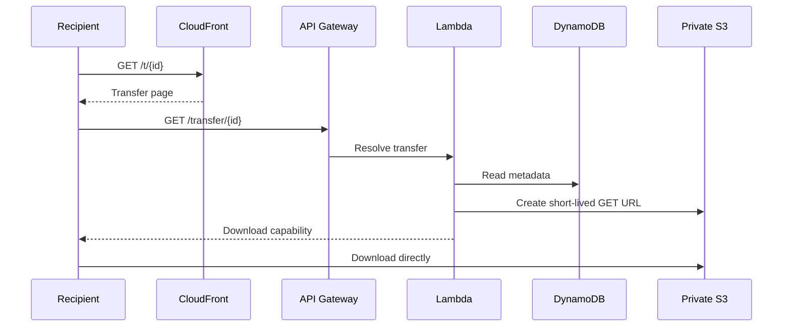

# ☁️ CloudDrop

> **Send files. Share the link. Done.**

CloudDrop is a fast, private, serverless file-transfer application built on AWS. It keeps guest sharing frictionless while giving authenticated users an optional dashboard for managing their own transfers.

[](LICENSE.txt)
[](https://aws.amazon.com/serverless/)
[](frontend/)
[](infrastructure/cfn/main.yaml)
[](.github/workflows/deploy.yml)

**Live deployment:** use the `CloudFrontURL` output from the deployed CloudFormation stack.

---

## What CloudDrop does

The core experience is intentionally small:

**Choose files → upload → get a link → share.**

No account is required for the guest transfer flow. Files are uploaded directly from the browser to private S3 through short-lived presigned URLs. Recipients receive a short-lived download capability without receiving AWS credentials.

### Product principles

- **Frictionless:** guest sharing remains the default.
- **Private by default:** S3 objects are not public.
- **Direct transfer:** file bytes do not pass through Lambda during normal upload/download.
- **Short-lived access:** presigned URLs expire quickly.
- **Server-side authorization:** authenticated management actions enforce ownership in Lambda.
- **Serverless and cost-conscious:** no always-on servers, containers, RDS, NAT Gateway or Kubernetes are required.

---

## ✨ Features

### Transfer

- Drag-and-drop and browser file selection.
- Single-file and multi-file transfer APIs.
- Multi-file transfers are packaged into a ZIP for recipient download.
- Upload progress and clear success/error states.
- Share-link copying.
- Optional email sharing through SES when a verified sender is configured.
- Guest transfers without mandatory registration.

### Recipient

- Dedicated `/t/{transferId}` transfer route.
- Transfer state and expiry handling.
- Short-lived presigned S3 download URLs.
- Clean not-found, incomplete and expired states.

### Accounts

- AWS Cognito authentication.
- Optional authenticated dashboard.
- Owner-scoped transfer listing.
- Server-side ownership checks for deletion.

### Lifecycle

- Seven-day application transfer expiry.
- DynamoDB TTL for metadata cleanup.
- S3 lifecycle expiration for stored objects.
- Download counters.

---

## 🏗️ Architecture



### AWS services

| Service | Responsibility |
|---|---|
| **Amazon S3** | Private frontend assets and private transfer objects |
| **Amazon CloudFront** | HTTPS/CDN delivery and `/t/*` route rewriting |
| **API Gateway** | REST API entry point |
| **AWS Lambda** | Validation, transfer state, authorization and signed URLs |
| **DynamoDB** | Transfer metadata, ownership, expiry and download counters |
| **Cognito** | Optional authentication for account management |
| **SES** | Optional transfer-link email delivery |
| **CloudFormation** | Infrastructure as Code |
| **GitHub Actions** | Validation and deployment automation |

The design deliberately avoids EC2, RDS, ECS, EKS, NAT Gateway, ElastiCache and third-party monitoring services.

---

## 🔄 Request lifecycle

### Guest upload



### Recipient download



### Authenticated management

```text
Cognito login
   ↓
JWT → protected API
   ↓
GET /user/transfers
   ↓
OwnerIndex query
   ↓
Only the authenticated user's transfers

DELETE /transfer/{id}
   ↓
Server-side owner check
   ↓
Delete metadata + S3 objects
```

---

## 🔐 Security model

CloudDrop follows a simple security boundary: **the browser gets capabilities, never AWS credentials.**

### Storage

- S3 Block Public Access is enabled.
- Frontend S3 access is through CloudFront OAI.
- Uploads use presigned PUT URLs.
- Downloads use presigned GET URLs with a five-minute signing window.
- Object keys are generated server-side rather than derived directly from user filenames.
- S3 uses server-side encryption.

### Authorization

- Guest transfer creation/download is intentionally public.
- Dashboard listing and deletion are Cognito-protected API operations.
- Lambda compares the authenticated Cognito subject with the stored `ownerId` before deletion.
- Frontend authentication state is never treated as an authorization boundary.

### Validation

Server-side validation covers file count, file size, total size, filenames, transfer identifiers, expiry and email/link input. User-controlled filenames are sanitized before being placed in download response headers.

### Error handling

Clients receive stable error codes/messages instead of raw AWS exception messages. Lambda logs retain diagnostic context without logging credentials or presigned URLs.

### Presigned URL warning

A presigned URL is a bearer capability: anyone holding it can use it until it expires. CloudDrop therefore keeps the underlying bucket private and keeps signed download URLs short-lived.

See [`SECURITY.md`](SECURITY.md) for the vulnerability-reporting and deployment-security policy.

---

## 🌐 API surface

| Method | Route | Authentication | Purpose |
|---|---|---|---|
| `POST` | `/transfer` | Guest / optional auth | Single-file transfer creation |
| `GET` | `/transfer/{id}` | Public | Resolve a ready transfer and create a download URL |
| `POST` | `/transfer/{id}/complete` | Public | Complete a single-file upload |
| `DELETE` | `/transfer/{id}` | Cognito | Delete an owned transfer |
| `POST` | `/batch` | Guest / optional auth | Create a multi-file transfer |
| `POST` | `/batch/{id}/complete` | Public | Finalize a multi-file ZIP transfer |
| `GET` | `/user/transfers` | Cognito | List owned transfers |
| `POST` | `/send-email` | Public | Send a transfer link when SES is configured |

API URLs are generated by CloudFormation; the deployment workflow writes the active API URL to `frontend/js/config.js` rather than embedding an environment-specific API endpoint in the source page.

---

## 🗂️ Repository structure

```text
cloud-drop/
├── .github/workflows/deploy.yml
├── backend/functions/              # Standalone Lambda source
│   ├── batch-complete/
│   ├── batch-create/
│   ├── complete-upload/
│   ├── create-transfer/
│   ├── get-transfer/
│   └── send-email/
├── docs/adr/                       # Architecture decisions
├── frontend/
│   ├── css/style.css
│   ├── js/config.js
│   ├── js/theme.js
│   ├── index.html
│   ├── login.html
│   ├── signup.html
│   ├── dashboard.html
│   └── t.html
├── infrastructure/cfn/main.yaml
├── scripts/deploy.sh
├── scripts/destroy.sh
├── cloudfront-function.js
├── cors.json
├── deploy-lambdas.bat
├── setup.sh
├── CONTRIBUTING.md
├── CODE_OF_CONDUCT.md
├── LICENSE.txt
├── SECURITY.md
└── README.md
```

> CloudFormation currently contains inline Lambda handlers while `backend/functions/` contains standalone source. This is intentionally documented rather than hidden. Backend changes must remain synchronized with the deployed IaC until the packaging model is migrated.

---

## 🚀 Deployment

### Prerequisites

- AWS CLI configured for the target account.
- Git.
- Node.js for local JavaScript tooling.
- An AWS identity authorized to deploy the CloudFormation resources.
- For multi-file ZIP support, provide the `ArchiverLayerArn` parameter for a Lambda layer containing `archiver`.
- For email sharing, provide `SesSourceEmail` using an SES-verified sender.

### CloudFormation

```bash
aws cloudformation deploy \
  --template-file infrastructure/cfn/main.yaml \
  --stack-name clouddrop-dev \
  --parameter-overrides Environment=dev \
  --capabilities CAPABILITY_IAM
```

Then sync the frontend:

```bash
ACCOUNT_ID=$(aws sts get-caller-identity --query Account --output text)
aws s3 sync frontend/ "s3://clouddrop-frontend-dev-${ACCOUNT_ID}" --delete
```

Invalidate CloudFront after frontend changes:

```bash
DIST_ID=$(aws cloudformation describe-stack-resource \
  --stack-name clouddrop-dev \
  --logical-resource-id CloudFrontDistribution \
  --query StackResourceDetail.PhysicalResourceId \
  --output text)
aws cloudfront create-invalidation --distribution-id "$DIST_ID" --paths '/*'
```

### GitHub Actions

Pushes to `main` run validation and deployment. The deployment workflow uses GitHub OIDC and expects the repository secret:

```text
AWS_DEPLOY_ROLE_ARN
```

The AWS role should trust the GitHub Actions OIDC provider and be limited to the resources/actions required by the deployment process.

The workflow also generates `frontend/js/config.js` from the deployed `ApiGatewayURL`, so environment-specific API URLs do not need to be committed.

---

## 🧪 Validation

CI performs:

- JavaScript syntax checks with `node --check`.
- Merge-conflict marker detection.
- CloudFormation linting with `cfn-lint`.
- AWS CloudFormation template validation.
- Deployment only after validation succeeds.

Useful local command:

```bash
aws cloudformation validate-template \
  --template-body file://infrastructure/cfn/main.yaml
```

Core manual acceptance flow:

1. Open CloudDrop.
2. Upload one or more files.
3. Confirm progress reaches completion.
4. Copy/open the generated `/t/{id}` link.
5. Download the transfer.
6. Test an unknown/expired transfer.
7. Sign in and verify the dashboard contains only the authenticated user's transfers.
8. Attempt deletion and verify ownership is enforced.

The repository does not yet contain a complete automated integration-test suite, so deployment validation and manual end-to-end verification remain important.

---

## 💸 Cost philosophy

CloudDrop is designed for production quality without automatically turning into an expensive AWS estate.

Core services are pay-per-use/serverless:

- S3
- CloudFront
- API Gateway
- Lambda
- DynamoDB on-demand
- Cognito when accounts are used
- SES when email sharing is used

No NAT Gateway, RDS, ECS, EKS, ElastiCache or always-on application server is required.

There is intentionally no fixed "\$0.10/month" promise: real cost depends on storage, data transfer, API calls, CloudFront requests, Lambda execution, DynamoDB usage and email volume.

---

## 🧭 Architecture decisions

See [`docs/adr/`](docs/adr/) for the project's recorded architectural decisions, including:

- S3 object storage.
- Direct browser-to-S3 uploads.
- DynamoDB instead of RDS.
- Lambda instead of EC2.
- CloudFront delivery.
- Optional Cognito authentication.
- No NAT Gateway.
- Serverless cost model.
- Cleanup/lifecycle strategy.

---

## 🛡️ Production checklist

Before treating a deployment as a public high-volume service, verify:

- [ ] GitHub OIDC deployment role is least privilege.
- [ ] No long-lived AWS access keys are stored in GitHub Actions.
- [ ] `FrontendOrigin` is restricted to the real CloudFront/custom-domain origin instead of `*`.
- [ ] SES sender/domain is verified and production access is enabled if email sharing is used.
- [ ] `ArchiverLayerArn` points to a tested layer for batch ZIP creation.
- [ ] API Gateway throttling/quotas match expected public traffic and abuse risk.
- [ ] CloudWatch log retention/alerts are appropriate for the account.
- [ ] Any historically exposed credentials have been rotated/revoked.
- [ ] The live guest upload, recipient download, authenticated dashboard and deletion flows have been exercised against the deployed stack.

These are operational controls; they do not require adding expensive infrastructure by default.

---

## 🤝 Contributing

Please read:

- [`CONTRIBUTING.md`](CONTRIBUTING.md)
- [`CODE_OF_CONDUCT.md`](CODE_OF_CONDUCT.md)
- [`SECURITY.md`](SECURITY.md)

Keep changes focused, preserve guest sharing, avoid unnecessary dependencies/services, and never commit credentials or environment secrets.

## 📄 License

CloudDrop is released under the [MIT License](LICENSE.txt).
