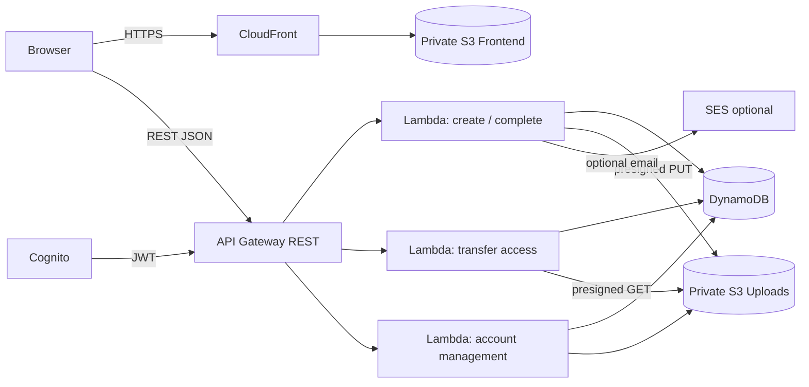

# CloudDrop

> **Send files. Share the link. Done.**

CloudDrop is a guest-first, privacy-focused serverless file-transfer platform inspired by WeTransfer and TransferNow. It lets users create a time-limited transfer without an account, uploads file bytes directly from the browser to private Amazon S3 using presigned URLs, and gives recipients short-lived download access. Authentication is optional and is used for transfer management.

[](LICENSE.txt)
[](https://aws.amazon.com/serverless/)
[](frontend/)
[](infrastructure/cfn/main.yaml)
[](.github/workflows/deploy.yml)

## 🚀 Live Demo

**Frontend:** https://d31ipw1qs2uo7j.cloudfront.net/

**API base:** https://cskjg8lwvd.execute-api.us-east-1.amazonaws.com/dev

**Repository:** https://github.com/Ibad84671/cloud-drop

The deployed application is served through Amazon CloudFront. The REST API is exposed through Amazon API Gateway and backed by AWS Lambda, DynamoDB, Cognito, and private S3 storage.

> **Demo note:** the live environment is a development deployment. Do not upload sensitive or confidential files to the public demo.

## ✨ What is verified

The deployed backend has been tested end-to-end with a real file transfer, not only mocked API responses.

- `POST /batch` created a transfer and returned a presigned S3 upload URL.
- A real `test.txt` file was uploaded directly to private S3 and S3 returned `200 OK`.
- The backend detected an intentional file-size mismatch and rejected it with `UPLOAD_SIZE_MISMATCH`.
- The corrected 6-byte file was uploaded successfully.
- `POST /batch/{id}/complete` returned `status: ready`.
- `BatchCompleteFunction` successfully loaded `archiver` and created the ZIP.
- `GET /transfer/{id}` returned a short-lived S3 download URL.
- The ZIP was downloaded and extracted successfully.
- The extracted `test.txt` was verified at 6 bytes with the expected content.

This confirms the complete path:

```text
Browser / API client
       ↓
   API Gateway
       ↓
 BatchCreate Lambda
       ↓
 DynamoDB metadata
       ↓
Presigned S3 PUT URL
       ↓
  Private S3 upload
       ↓
BatchComplete Lambda
       ↓
 ZIP finalization with archiver
       ↓
  ZIP stored in S3
       ↓
 GetTransfer Lambda
       ↓
Presigned S3 GET URL
       ↓
   ZIP download
       ↓
   ZIP extraction
```

## Product principles

- **Guest first:** basic file sharing does not require registration.
- **Private by default:** upload storage is not public.
- **Direct transfer:** browsers upload file bytes directly to S3 instead of sending them through Lambda.
- **Short-lived access:** upload URLs expire after 15 minutes and download URLs expire after 5 minutes.
- **Time-limited transfers:** transfer metadata expires after 7 days and transfer objects are lifecycle-cleaned after 8 days.
- **Optional accounts:** Cognito protects management operations without becoming a barrier to basic sharing.
- **Cost conscious:** the architecture avoids EC2, RDS, ECS, EKS, NAT Gateway, and paid third-party monitoring platforms.

## Features

### Guest transfer

- Drag-and-drop and browser file selection.
- Up to 20 files per transfer.
- Up to 2 GB total transfer size.
- Server-side filename, MIME-type, count, and size validation.
- Direct browser-to-S3 presigned uploads.
- Completion verifies the actual S3 object size and content type.
- Multi-file transfers are finalized into a ZIP.
- Shareable `/t/{transferId}` links.

### Recipient

- No account required.
- Server-side transfer state and expiry checks.
- Direct download from private S3 using a five-minute presigned URL.
- Clear handling for expired, missing, malformed, and incomplete transfers.

### Optional account

- Cognito email/password sign-up.
- Cognito Hosted UI authorization-code + PKCE login.
- Session-scoped browser tokens.
- Authenticated transfer listing.
- Server-side ownership enforcement for deletion.
- Paginated dashboard results.

### Optional email sharing

If a verified SES sender is configured, `/send-email` can send a canonical CloudFront transfer link. The backend accepts the transfer ID and constructs the link server-side rather than trusting a browser-supplied URL.

## 🏗️ Architecture



### Why this architecture?

CloudDrop keeps the file-byte path out of Lambda. Lambda handles metadata, validation, authorization, presigned URL generation, transfer state, and ZIP finalization. S3 handles file storage and delivery. DynamoDB provides low-cost metadata storage with TTL cleanup. CloudFront serves the static frontend and rewrites `/t/<id>` to the recipient page.

## 🔄 Request flow

### Upload

```text
Browser
  ↓ POST /batch
API Gateway
  ↓
BatchCreate Lambda
  ↓ validate metadata + create transfer record
DynamoDB
  ↓
Browser receives presigned PUT URL(s)
  ↓
Private S3
  ↓ POST /batch/{id}/complete
BatchComplete Lambda
  ↓ verify every expected object
  ↓ create ZIP when needed
DynamoDB → status=ready
```

### Download

```text
Recipient opens /t/{id}
  ↓
CloudFront → t.html
  ↓ GET /transfer/{id}
API Gateway → Lambda
  ↓
DynamoDB state + expiry check
  ↓
5-minute S3 presigned GET URL
  ↓
Recipient downloads directly from private S3
```

### Authenticated management

```text
Cognito authorization-code + PKCE
  ↓
sessionStorage token
  ↓
GET /user/transfers   → OwnerIndex query
DELETE /transfer/{id} → server-side owner check
```

## 🔌 API contract

| Method | Route | Auth | Purpose |
|---|---|---|---|
| `POST` | `/batch` | Guest / optional auth | Create a transfer and presigned upload URLs |
| `POST` | `/batch/{id}/complete` | Public | Verify uploads and finalize the transfer |
| `GET` | `/transfer/{id}` | Public | Resolve a ready transfer and create a short-lived download URL |
| `DELETE` | `/transfer/{id}` | Cognito | Delete an owned transfer |
| `GET` | `/user/transfers` | Cognito | List transfers owned by the signed-in user |
| `POST` | `/send-email` | Public, SES required | Send a canonical transfer link by email |

Application errors use a stable shape:

```json
{
  "success": false,
  "error": {
    "code": "TRANSFER_NOT_FOUND",
    "message": "Transfer not found."
  }
}
```

## 🔐 Security model

CloudDrop treats the browser as untrusted.

- S3 Block Public Access is enabled for both buckets.
- Frontend S3 is readable through the CloudFront Origin Access Identity.
- Upload storage is private.
- Upload and download URLs are temporary capabilities rather than permanent credentials.
- Random transfer IDs and object keys reduce accidental enumeration.
- Uploaded object size and content type are verified again during completion.
- Download access checks transfer existence, readiness, and expiry server-side.
- Dashboard and delete endpoints require Cognito authorization.
- Delete operations enforce ownership server-side and use a DynamoDB conditional delete.
- API Gateway stage throttling provides lightweight abuse resistance.
- Lambda responses do not expose raw AWS exception messages to clients.
- Logs avoid exposing tokens, credentials, and presigned URLs.
- CloudFront response headers include HSTS, frame protection, MIME sniffing protection, Referrer-Policy, Permissions-Policy, and CSP.

## ☁️ AWS services

| Service | Responsibility |
|---|---|
| Amazon S3 | Frontend hosting origin and private transfer objects |
| Amazon CloudFront | HTTPS delivery and `/t/<id>` route rewrite |
| API Gateway REST | Public API boundary |
| AWS Lambda | Validation, metadata, ZIP finalization, authorization |
| DynamoDB | Transfer metadata, ownership index, TTL |
| Amazon Cognito | Optional authentication and management authorization |
| Amazon SES | Optional email sharing |

The architecture does not require NAT Gateway, RDS, EC2, ECS, EKS, ALB, OpenSearch, Redis, or a paid monitoring platform.

## 📁 Repository structure

```text
cloud-drop/
├── .github/workflows/deploy.yml     # validation + OIDC deployment
├── backend/functions/               # readable Lambda source mirrors
│   ├── batch-create/
│   ├── batch-complete/
│   ├── get-transfer/
│   ├── list-transfers/
│   ├── delete-transfer/
│   └── send-email/
├── docs/adr/                        # architectural decisions
├── frontend/
│   ├── index.html                   # guest upload experience
│   ├── t.html                       # recipient transfer page
│   ├── login.html                   # Cognito login entry point
│   ├── auth-callback.html           # OAuth code exchange
│   ├── signup.html
│   ├── dashboard.html
│   ├── css/
│   └── js/
├── infrastructure/cfn/main.yaml    # infrastructure source of truth
├── scripts/
│   ├── deploy.sh
│   └── destroy.sh
├── tests/smoke.test.js
├── package.json
├── SECURITY.md
├── CONTRIBUTING.md
├── CODE_OF_CONDUCT.md
├── LICENSE.txt
└── README.md
```

Generated deployment artifacts, local credentials, ZIP packages, AWS command output, and `node_modules` are intentionally excluded from version control.

## 🧪 Testing and verification

### Repository checks

The smoke suite checks JavaScript syntax, HTML structure, remote script dependencies, merge-conflict markers, Cognito configuration, protected API methods, throttling, OIDC deployment configuration, archiver configuration, and generated-artifact hygiene.

The CI workflow also runs CloudFormation linting and AWS template validation before deployment.

### AWS validation performed on the deployed environment

```text
POST /batch                         → 201 Created
S3 presigned PUT                    → 200 OK
Incorrect declared size             → UPLOAD_SIZE_MISMATCH
Corrected upload                    → 200 OK
POST /batch/{id}/complete           → 200 OK, status=ready
GET /transfer/{id}                  → 200 OK, download URL
ZIP download                        → successful
ZIP extraction                      → successful
Extracted test.txt                  → 6 bytes, verified
```

The final verification used an actual S3 object and an actual generated ZIP. This is stronger than a unit-test-only claim because it exercises API Gateway, Lambda, DynamoDB, S3 presigned access, ZIP finalization, and download delivery together.

## 🚀 Deployment

### Prerequisites

- AWS CLI configured for the target account and region.
- Node.js.
- A compatible Lambda layer containing `archiver` for ZIP finalization.
- A verified SES sender only if email sharing is required.

### Validate first

```bash
npm test
python -m pip install --disable-pip-version-check cfn-lint
cfn-lint infrastructure/cfn/main.yaml
aws cloudformation validate-template --template-body file://infrastructure/cfn/main.yaml
```

### Deploy

The deployment helper refuses to deploy without the archiver layer because multi-file ZIP transfers are a core feature.

```bash
export AWS_REGION=us-east-1
export STACK_NAME=clouddrop-dev
export ENVIRONMENT=dev
export ARCHIVER_LAYER_ARN='arn:aws:lambda:us-east-1:<ACCOUNT_ID>:layer:clouddrop-archiver:<VERSION>'
# Optional:
# export SES_SOURCE_EMAIL='verified@example.com'

./scripts/deploy.sh
```

The deployment script obtains API Gateway, Cognito, CloudFront, and email-sharing configuration from CloudFormation outputs and generates `frontend/js/config.js` before syncing the frontend.

### GitHub Actions

Pushes to `main` run validation first. Deployment uses GitHub OIDC and requires:

- `AWS_DEPLOY_ROLE_ARN`
- `ARCHIVER_LAYER_ARN`
- `SES_SOURCE_EMAIL` (optional)

Long-lived AWS access keys are intentionally not used by the workflow.

## 🧹 Destruction / cost control

For a clean development teardown:

```bash
./scripts/destroy.sh
```

The destroy helper empties the managed S3 buckets before deleting the CloudFormation stack, avoiding failed stack deletion caused by non-empty buckets.

## 📸 Screenshots

Real deployment screenshots are intentionally kept out of this commit rather than using mock or unrelated images. The next documentation pass should add one or two captures from the live CloudFront deployment (upload screen + completed/download screen) under `docs/screenshots/`.

## 📚 Documentation

- [Security policy](SECURITY.md)
- [Contributing guide](CONTRIBUTING.md)
- [Architecture decisions](docs/adr/)
- [CloudFormation template](infrastructure/cfn/main.yaml)
- [Deployment workflow](.github/workflows/deploy.yml)

## 💰 Cost philosophy

CloudDrop deliberately uses request-based AWS services and avoids infrastructure with a fixed monthly floor. There is no NAT Gateway, relational database, container cluster, or always-on compute requirement.

The ZIP finalization Lambda is intentionally the heavier path. It uses configurable ephemeral storage and the archiver dependency so multi-file transfers can be assembled without buffering the complete archive in Lambda memory.

## Known operational requirements

1. The BatchComplete Lambda needs a compatible `archiver` package available through the configured deployment layer/package.
2. SES email sharing requires a verified sender and an AWS account/region permitted to send email.
3. GitHub Actions deployment requires an AWS OIDC trust relationship for `AWS_DEPLOY_ROLE_ARN`.
4. CloudFront and Cognito are created during deployment, so runtime frontend configuration must be generated from stack outputs rather than hardcoded.

## License

MIT. See [LICENSE.txt](LICENSE.txt).
