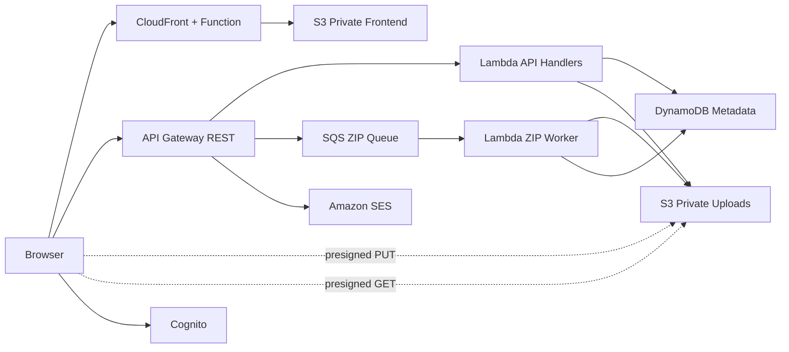

# ☁️ CloudDrop

> **Fast, Simple, Secure File Sharing — Powered by AWS Serverless**

CloudDrop is a serverless file-sharing platform built around direct-to-S3 uploads, short-lived presigned download URLs, optional Cognito authentication, and asynchronous ZIP creation for multi-file transfers.

## Highlights

- **Guest sharing** — no account required for basic transfers.
- **Multi-file uploads** — up to 50 files and 2 GB total per transfer.
- **Direct S3 data path** — Lambda never proxies file bytes during upload/download.
- **Asynchronous ZIP jobs** — SQS + Lambda keep long archive work out of API Gateway's synchronous request path.
- **7-day transfer lifetime** — application expiry plus S3 lifecycle cleanup.
- **Optional authentication** — Cognito protects the dashboard and destructive actions.
- **Private storage** — S3 Block Public Access with CloudFront Origin Access Control for the frontend.
- **Least-privilege IAM** — separate roles by data-access boundary.
- **CI/CD** — GitHub Actions with AWS OIDC; no long-lived AWS access keys are required by the workflow.
- **API throttling** — baseline abuse and cost guardrail at the API stage.

## Architecture



### Multi-file transfer flow

1. Browser sends file metadata to `POST /batch`.
2. Lambda validates metadata, stores transfer state, and returns presigned S3 PUT URLs.
3. Browser uploads file bytes directly to private S3.
4. Browser calls `POST /batch/{id}/complete`.
5. The API Lambda places a ZIP job on SQS and returns `202 Accepted` immediately.
6. A worker Lambda streams source objects into a ZIP and writes the archive to S3 using multipart upload.
7. The browser polls `GET /transfer/{id}` until the transfer becomes `ready`.
8. The API returns a five-minute presigned download URL.

## Repository layout

```text
cloud-drop/
├── backend/functions/
│   ├── create-transfer/
│   ├── complete-upload/
│   ├── get-transfer/
│   ├── list-transfers/
│   ├── delete-transfer/
│   ├── batch-create/
│   ├── batch-complete-enqueue/
│   ├── batch-complete/
│   └── send-email/
├── frontend/
│   ├── index.html
│   ├── login.html
│   ├── signup.html
│   ├── dashboard.html
│   ├── t.html
│   ├── css/
│   └── js/
├── infrastructure/cfn/
│   ├── bootstrap.yaml
│   └── main.yaml
├── scripts/
├── .github/workflows/deploy.yml
├── SECURITY.md
├── CONTRIBUTING.md
└── LICENSE.txt
```

## Deployment

### Prerequisites

- AWS account and AWS CLI.
- GitHub Actions OIDC trust configured for this repository.
- GitHub Actions secret `AWS_ROLE_TO_ASSUME` containing the deployment role ARN.
- Optional GitHub Actions secret `SES_FROM_EMAIL` containing a verified SES sender address.

The deployment role should be scoped specifically to this repository/workflow. Do not use long-lived IAM user access keys in GitHub Actions.

### CI/CD

Pushes to `main` run validation, package Lambda artifacts, publish them to the private artifact bucket, deploy CloudFormation, generate `frontend/js/config.js` from stack outputs, sync the frontend, and invalidate CloudFront.

Pull requests run CloudFormation linting and JavaScript syntax checks without deploying.

### Local deployment

The deployment is split into a bootstrap artifact bucket and the application stack:

```bash
ACCOUNT_ID=$(aws sts get-caller-identity --query Account --output text)
ARTIFACT_BUCKET="clouddrop-artifacts-${ACCOUNT_ID}"
VERSION=$(git rev-parse HEAD)

aws cloudformation deploy \
  --template-file infrastructure/cfn/bootstrap.yaml \
  --stack-name clouddrop-bootstrap \
  --parameter-overrides ArtifactBucketName="$ARTIFACT_BUCKET"

mkdir -p .artifacts
for dir in backend/functions/*; do
  if [ -f "$dir/index.js" ]; then
    name=$(basename "$dir")
    (cd "$dir" && zip -q -j "../../../.artifacts/${name}-${VERSION}.zip" index.js)
  fi
done
aws s3 sync .artifacts/ "s3://$ARTIFACT_BUCKET/lambdas/"

aws cloudformation deploy \
  --template-file infrastructure/cfn/main.yaml \
  --stack-name clouddrop-dev \
  --parameter-overrides Environment=dev ArtifactBucketName="$ARTIFACT_BUCKET" CodeVersion="$VERSION" SesFromEmail="" \
  --capabilities CAPABILITY_IAM
```

The GitHub Actions workflow also generates the runtime frontend configuration from CloudFormation outputs, so Cognito/API IDs are not hard-coded into the website source.

## Security model

- Upload and download buckets are private with S3 Block Public Access.
- CloudFront uses Origin Access Control (OAC) rather than a legacy OAI.
- Presigned upload URLs expire after 15 minutes.
- Presigned download URLs expire after 5 minutes.
- Transfer links expire after 7 days; S3 lifecycle cleanup provides a storage backstop.
- Dashboard and delete operations use Cognito authorization and verify the authenticated `sub` against `ownerId`.
- User-controlled filenames are sanitized before ZIP metadata, HTTP headers, HTML email, and dashboard HTML use.
- Batch completion validates each uploaded object's size against server-side metadata.
- ZIP creation is asynchronous and streamed into S3 multipart upload, avoiding a multi-gigabyte in-memory Lambda ZIP.
- API Gateway stage throttling limits request pressure.

## Runtime and testing

Lambda uses the supported Node.js 24 runtime. AWS currently lists Node.js 24 as supported through April 30, 2028. citeturn9search0

CI checks:

- CloudFormation linting for `bootstrap.yaml` and `main.yaml`.
- `node --check` for every Lambda source file.

## Cost

CloudDrop avoids always-on EC2, RDS, NAT Gateway, and container infrastructure. Actual cost depends on traffic, storage, CloudFront transfer, API calls, SES usage, and ZIP processing time. Use current AWS pricing and CloudWatch usage data rather than relying on a fixed portfolio estimate.

## License

MIT — see [LICENSE.txt](LICENSE.txt).
