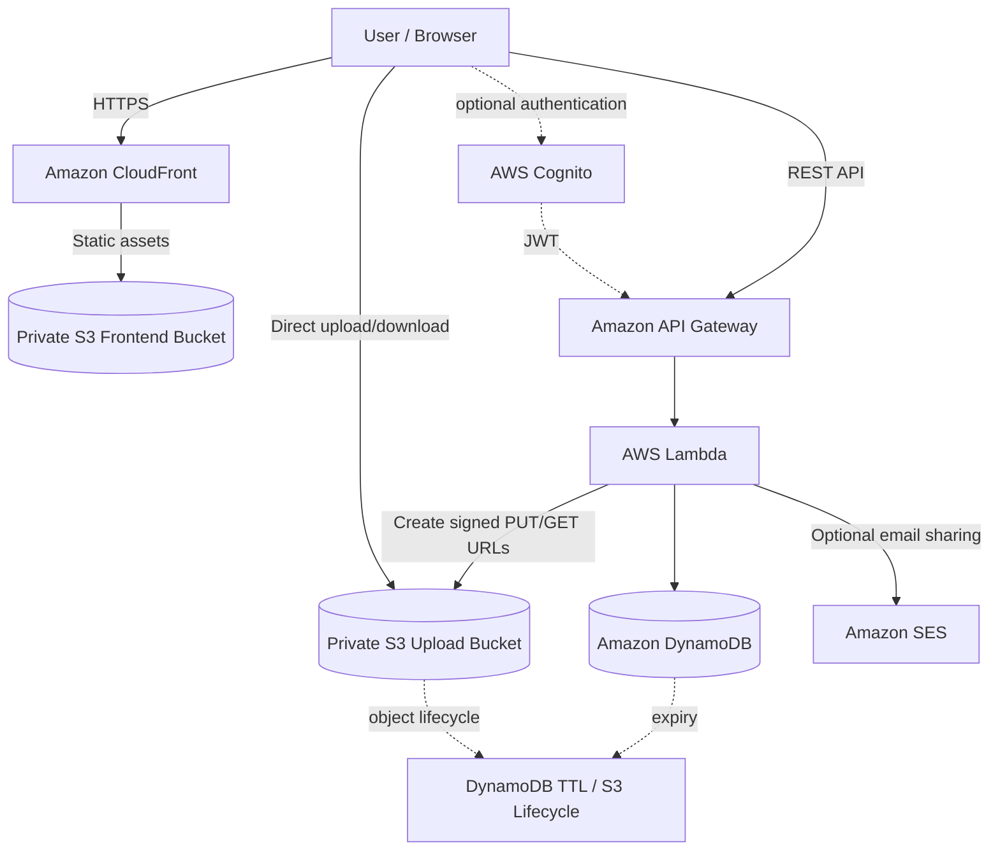
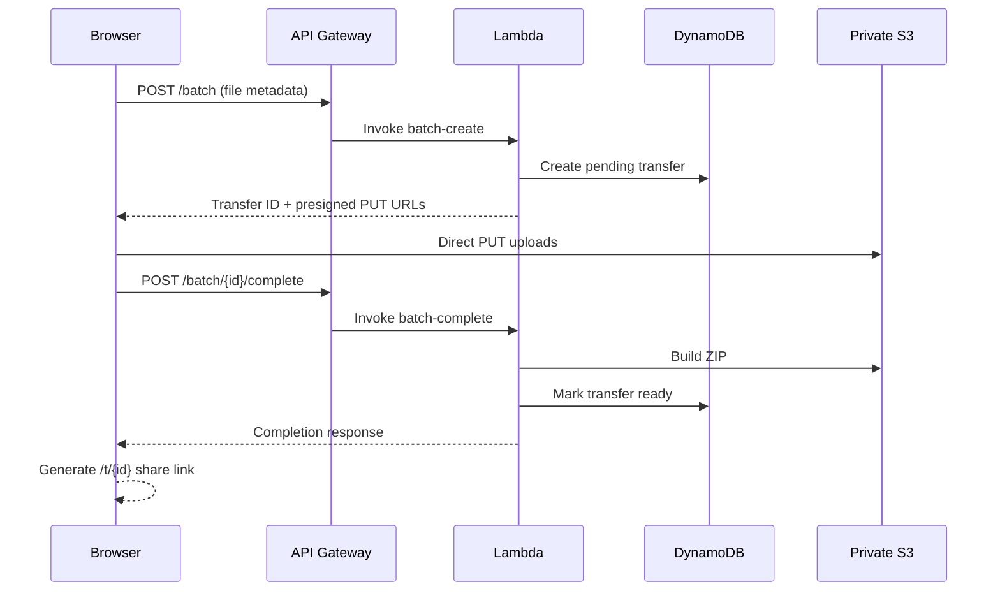
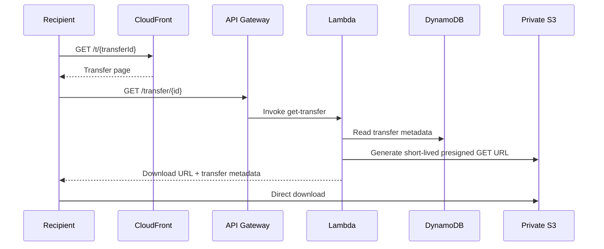

# ☁️ CloudDrop

> **Send files. Share the link. Done.**

CloudDrop is a fast, frictionless serverless file-transfer application built on AWS. Upload one or more files without creating an account, receive a shareable link, and let recipients download the transfer directly from private S3 through short-lived presigned URLs.

[](LICENSE.txt)
[](https://aws.amazon.com/serverless/)
[](frontend/)
[](infrastructure/cfn/main.yaml)
[](.github/workflows/deploy.yml)

**Live demo:** [https://d4smvqjjk25nu.cloudfront.net](https://d4smvqjjk25nu.cloudfront.net)

---

## Why CloudDrop?

Most file-transfer products make a simple job feel like account management. CloudDrop keeps the core interaction deliberately small:

**Choose files → upload → get a link → share.**

Authentication is optional. Guests can use the primary sharing flow without signing up, while authenticated users get a dashboard for managing their own transfers.

### Product principles

- **Frictionless** — guest sharing is a first-class flow.
- **Private by default** — uploaded objects live in private S3 storage.
- **Direct transfer** — files move between the browser and S3 using presigned URLs rather than passing through Lambda.
- **Short-lived access** — transfer metadata and signed download URLs have explicit expiry controls.
- **Serverless** — no servers, containers, or always-on database required.
- **Cost-conscious** — use managed, pay-per-use AWS primitives instead of adding infrastructure for appearance alone.

---

## ✨ Features

### File sharing

- Drag-and-drop and browser file selection.
- Multi-file uploads.
- Multi-file transfers can be packaged into a ZIP for download.
- Upload progress and transfer completion states.
- One-click share-link copying.
- Optional email sharing through Amazon SES.
- Guest transfers without mandatory authentication.

### Recipient experience

- Dedicated transfer route: `/t/{transferId}`.
- Transfer metadata and download state.
- Short-lived presigned download URLs.
- Clear handling for missing, incomplete, and expired transfers.

### Account experience

- AWS Cognito authentication.
- Optional authenticated dashboard.
- List transfers belonging to the authenticated user.
- Delete owned transfers.

### Lifecycle

- Transfer records carry expiry metadata.
- DynamoDB TTL is configured for metadata cleanup.
- S3 lifecycle expiration is intended to remove stored transfer objects.
- Download counts are tracked in transfer metadata.

---

## 🏗️ Architecture

CloudDrop deliberately keeps the runtime architecture small:



### Why this architecture?

| Layer | AWS service | Responsibility |
|---|---|---|
| Edge | CloudFront | HTTPS delivery, CDN caching, transfer-route handling |
| Frontend | S3 | Private static website assets |
| API | API Gateway | REST entry point for transfer operations |
| Compute | Lambda | Stateless application logic and signed URL generation |
| Storage | S3 | Private file/object storage |
| Metadata | DynamoDB | Transfer state, ownership, expiry and download metadata |
| Auth | Cognito | Optional user authentication and protected dashboard routes |
| Email | SES | Optional transfer-link email delivery |
| IaC | CloudFormation | AWS resource definition and deployment |
| CI/CD | GitHub Actions | Validation and deployment automation |

No EC2, RDS, ECS, EKS, NAT Gateway, or always-on application server is required by the core design.

---

## 🔄 Request Flows

### Guest upload



### Recipient download



### Authenticated management

```text
Cognito login
    ↓
JWT supplied to protected API routes
    ↓
GET /user/transfers
    ↓
DynamoDB OwnerIndex query
    ↓
User sees only their own transfers

DELETE /transfer/{id}
    ↓
Server-side owner check
    ↓
Delete metadata + associated S3 objects
```

---

## 🔐 Security Model

CloudDrop is designed around the principle that the browser should never need AWS credentials.

### Storage

- Upload objects are stored in an S3 bucket with Block Public Access enabled.
- Files are uploaded directly using presigned S3 URLs.
- Downloads use short-lived presigned GET URLs.
- The application does not stream file bytes through Lambda.

### Authorization

- Guest routes are intentionally public because guest sharing is a core product requirement.
- Authenticated management routes use Cognito authorization.
- Transfer ownership is checked server-side before destructive operations.
- Frontend state is never treated as an authorization boundary.

### Data lifecycle

- Transfers carry explicit expiration timestamps.
- DynamoDB TTL is enabled for metadata cleanup.
- S3 lifecycle rules are used for object expiration.
- Expired transfers are rejected by the application even before eventual background cleanup completes.

### Important operational rule

A presigned URL is a capability: anyone who possesses it can use it until it expires. CloudDrop therefore keeps signed download URLs short-lived and keeps the underlying S3 objects private.

For vulnerability reporting, see [SECURITY.md](SECURITY.md).

---

## 🌐 API Surface

The current CloudFormation template defines these primary API routes:

| Method | Route | Auth | Purpose |
|---|---|---|---|
| `POST` | `/transfer` | Guest / optional auth | Create a single-file transfer and receive a presigned upload URL |
| `GET` | `/transfer/{id}` | Public | Resolve transfer metadata and a short-lived download URL |
| `POST` | `/transfer/{id}/complete` | Public | Mark a single-file upload complete |
| `POST` | `/batch` | Guest / optional auth | Create a multi-file transfer and presigned upload URLs |
| `POST` | `/batch/{id}/complete` | Public | Build the ZIP and finalize a batch transfer |
| `GET` | `/user/transfers` | Cognito | List transfers owned by the authenticated user |
| `DELETE` | `/transfer/{id}` | Cognito | Delete an owned transfer and associated objects |
| `POST` | `/send-email` | Public | Send a transfer link through SES |

> API Gateway URLs are generated from the CloudFormation stack. Do not hard-code a deployed API URL in documentation; use the stack output for the active environment.

---

## 🗂️ Repository Structure

```text
cloud-drop/
├── .github/
│   └── workflows/
│       └── deploy.yml              # GitHub Actions validation/deployment
│
├── backend/
│   └── functions/                  # Standalone Lambda source implementations
│       ├── batch-complete/
│       ├── batch-create/
│       ├── complete-upload/
│       ├── create-transfer/
│       ├── get-transfer/
│       └── send-email/
│
├── docs/
│   └── adr/                        # Architecture Decision Records
│
├── frontend/
│   ├── css/
│   │   └── style.css               # Shared UI styles
│   ├── js/
│   │   └── theme.js                # Theme handling
│   ├── index.html                   # Guest upload experience
│   ├── login.html                   # Authentication entry point
│   ├── signup.html                  # Registration flow
│   ├── dashboard.html               # Authenticated transfer management
│   └── t.html                        # Recipient download experience
│
├── infrastructure/
│   └── cfn/
│       └── main.yaml               # CloudFormation stack
│
├── scripts/
│   ├── deploy.sh                    # Manual deployment helper
│   └── destroy.sh                   # Stack teardown helper
│
├── cloudfront-function.js           # CloudFront viewer-request logic
├── cors.json                        # S3 CORS configuration helper
├── deploy-lambdas.bat               # Windows Lambda deployment helper
├── package.json                     # Project scripts/dependencies
├── setup.sh                          # Environment/setup helper
├── CONTRIBUTING.md
├── CODE_OF_CONDUCT.md
├── LICENSE.txt
├── SECURITY.md
└── README.md
```

> **Implementation note:** the current CloudFormation stack contains inline Lambda handlers, while `backend/functions/` contains standalone function source. When changing backend behavior, keep the deployed CloudFormation implementation and standalone source synchronized unless the deployment model is intentionally migrated.

---

## 🚀 Deployment

### Prerequisites

Install and configure:

- AWS CLI with credentials authorized to deploy the stack.
- Git.
- Node.js/npm if you use the project tooling.
- An AWS account with permission to create the resources defined in `infrastructure/cfn/main.yaml`.

### Deploy with the project script

```bash
git clone https://github.com/Ibad84671/cloud-drop.git
cd cloud-drop

./scripts/deploy.sh
```

On Windows, the repository also includes batch deployment helpers where required by the current workflow.

### Deploy manually

```bash
aws cloudformation deploy \
  --template-file infrastructure/cfn/main.yaml \
  --stack-name clouddrop-dev \
  --parameter-overrides Environment=dev \
  --capabilities CAPABILITY_IAM

ACCOUNT_ID=$(aws sts get-caller-identity --query Account --output text)
aws s3 sync frontend/ "s3://clouddrop-frontend-dev-${ACCOUNT_ID}" --delete

DIST_ID=$(aws cloudformation describe-stack-resource \
  --stack-name clouddrop-dev \
  --logical-resource-id CloudFrontDistribution \
  --query StackResourceDetail.PhysicalResourceId \
  --output text)

aws cloudfront create-invalidation \
  --distribution-id "$DIST_ID" \
  --paths '/*'
```

### Read stack outputs

```bash
aws cloudformation describe-stacks \
  --stack-name clouddrop-dev \
  --query 'Stacks[0].Outputs'
```

Useful outputs include:

- `CloudFrontURL`
- `ApiGatewayURL`
- `CognitoUserPoolId`
- `CognitoClientId`
- `CognitoDomain`

---

## 🧪 Validation & CI/CD

The repository uses GitHub Actions for the main deployment workflow.

The current workflow performs CloudFormation validation and, for pushes to `main`, deploys the stack, synchronizes the frontend, and invalidates CloudFront.

For local validation, at minimum run:

```bash
aws cloudformation validate-template \
  --template-body file://infrastructure/cfn/main.yaml
```

For frontend changes, verify the core flows manually in a browser:

1. Open the upload page.
2. Upload one or more files.
3. Confirm the upload completes.
4. Copy/open the generated transfer link.
5. Download the transfer.
6. Verify an expired or unknown transfer shows an appropriate error.
7. If authenticated, verify the dashboard only shows the current user's transfers.

> The repository currently does not contain a comprehensive automated unit/integration test suite. Manual verification is therefore important until those tests are added.

---

## 💸 Cost Philosophy

CloudDrop is intentionally designed around low operational overhead rather than maximum infrastructure density.

The core runtime uses managed, pay-per-use services:

- S3 for static assets and file storage.
- CloudFront for delivery.
- API Gateway for HTTP requests.
- Lambda for compute.
- DynamoDB on-demand for transfer metadata.
- Cognito only for optional authentication.
- SES only when email sharing is used.

There is deliberately **no always-on compute layer** and no NAT Gateway, relational database, container platform, Kubernetes cluster, cache cluster, or third-party observability platform in the core architecture.

Actual AWS cost depends on storage, transfer volume, API traffic, CloudFront usage, email volume, and the AWS pricing model/region in use. The repository therefore avoids promising a fixed monthly bill.

---

## 🧭 Architecture Decisions

The major architectural choices are documented as ADRs in [`docs/adr/`](docs/adr/):

- [ADR-001 — S3 object storage](docs/adr/ADR-001-s3-object-storage.md)
- [ADR-002 — Direct S3 uploads](docs/adr/ADR-002-direct-s3-uploads.md)
- [ADR-003 — DynamoDB instead of RDS](docs/adr/ADR-003-dynamodb-instead-of-rds.md)
- [ADR-004 — Lambda instead of EC2](docs/adr/ADR-004-lambda-instead-of-ec2.md)
- [ADR-005 — CloudFront](docs/adr/ADR-005-cloudfront.md)
- [ADR-006 — Optional Cognito authentication](docs/adr/ADR-006-cognito-optional.md)
- [ADR-007 — No NAT Gateway](docs/adr/ADR-007-no-nat-gateway.md)
- [ADR-008 — Serverless for cost](docs/adr/ADR-008-serverless-for-cost.md)
- [ADR-009 — EventBridge cleanup](docs/adr/ADR-009-eventbridge-cleanup.md)
- [ADR-010 — S3 lifecycle expiration](docs/adr/ADR-010-s3-lifecycle-expiration.md)

---

## 🛡️ Production Considerations

CloudDrop's architecture is production-oriented, but production readiness is more than selecting serverless services. Before operating it as a public high-volume service, review the deployed AWS configuration for:

- IAM least privilege per Lambda rather than shared broad roles.
- Explicit API Gateway throttling/quotas appropriate to expected abuse.
- Strict server-side file count, size, filename and metadata validation.
- Appropriate S3 CORS origins for the deployed frontend.
- Security headers and a CSP compatible with Cognito and required assets.
- CloudFormation validation in CI before deployment.
- GitHub Actions authentication using short-lived AWS credentials/OIDC rather than long-lived access keys where supported.
- SES production access and sender/domain verification before relying on email delivery.
- Monitoring and alerting appropriate to the expected traffic level.
- Rotation/revocation of any credential that may ever have been committed accidentally.

These are operational controls, not reasons to add unnecessary AWS services.

---

## 🤝 Contributing

Contributions are welcome. Please read:

- [CONTRIBUTING.md](CONTRIBUTING.md) for contribution workflow.
- [CODE_OF_CONDUCT.md](CODE_OF_CONDUCT.md) for community expectations.
- [SECURITY.md](SECURITY.md) for vulnerability reporting.

When contributing, prefer small, reviewable changes and preserve CloudDrop's core principle: **fast, simple, secure file sharing without mandatory accounts.**

---

## 🔒 Security Reporting

Please do not publish security vulnerabilities in a public issue.

See [SECURITY.md](SECURITY.md) for the project's security policy and reporting process.

---

## 📄 License

CloudDrop is released under the [MIT License](LICENSE.txt).

---

## 🌟 Project

CloudDrop is an AWS serverless engineering project focused on practical cloud architecture: secure object storage, presigned transfers, stateless compute, DynamoDB access patterns, optional identity, Infrastructure as Code, and cost-conscious operations.

**Repository:** https://github.com/Ibad84671/cloud-drop

**Live demo:** https://d4smvqjjk25nu.cloudfront.net
