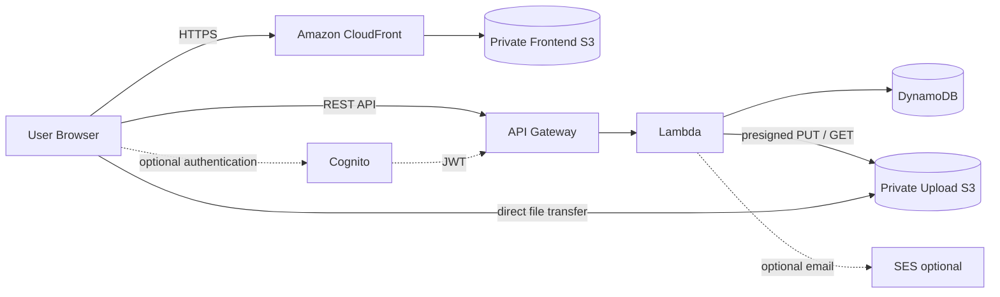
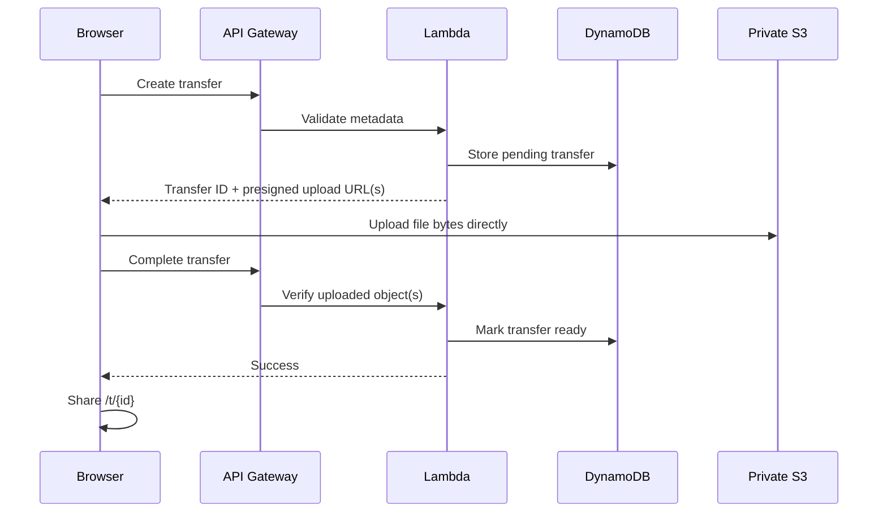
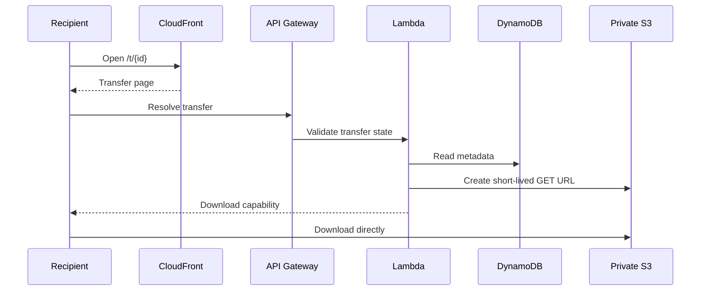

# ☁️ CloudDrop

> **Send files. Share the link. Done.**

CloudDrop is a lightweight, privacy-first file-transfer platform built with AWS serverless services. The product is intentionally simple: guests can send files without creating an account, recipients download through short-lived signed access, and authenticated users can manage their own transfers.

[](LICENSE.txt)
[](https://aws.amazon.com/serverless/)
[](frontend/)
[](infrastructure/cfn/main.yaml)
[](.github/workflows/deploy.yml)

## Why CloudDrop?

CloudDrop is designed around one idea: **file sharing should be effortless without making the infrastructure careless.**

- **Guest-first:** upload and share without mandatory registration.
- **Private storage:** transfer objects live in private S3 buckets.
- **Direct uploads:** browsers send file bytes directly to S3 using presigned URLs.
- **Short-lived access:** download capabilities expire quickly.
- **Optional accounts:** Cognito is used for authenticated transfer management, not as a barrier to basic sharing.
- **Serverless by design:** no EC2, RDS, containers, Kubernetes or NAT Gateway is required.
- **Cost-conscious:** the architecture favors managed, pay-per-use AWS services and avoids infrastructure that adds fixed cost without clear product value.

---

## ✨ Product capabilities

### Transfer flow

- Single-file transfers.
- Multi-file transfers with optional ZIP finalization.
- Drag-and-drop and browser file selection.
- Presigned browser-to-S3 uploads.
- Upload progress and transfer status feedback.
- Shareable `/t/{transferId}` links.
- Expiration-aware transfer handling.
- Optional SES email sharing when configured.

### Recipient experience

- Dedicated transfer page.
- Clear ready, incomplete, missing and expired states.
- Short-lived presigned download URLs.
- Direct S3 downloads instead of routing large files through Lambda.

### Authenticated experience

- AWS Cognito sign-up/sign-in.
- Optional dashboard.
- Owner-scoped transfer listing.
- Server-side ownership enforcement for destructive actions.

### Lifecycle

- Application-level transfer expiry.
- DynamoDB TTL for metadata cleanup.
- S3 lifecycle rules for object cleanup.
- Download counters and transfer status tracking.

---

## 🏗️ Architecture



### Service responsibilities

| AWS service | Responsibility |
|---|---|
| **Amazon S3** | Private frontend assets and private transfer objects |
| **Amazon CloudFront** | HTTPS delivery, caching and transfer-route rewriting |
| **Amazon API Gateway** | Public and Cognito-protected REST endpoints |
| **AWS Lambda** | Validation, transfer state, signed URLs, authorization and optional email orchestration |
| **Amazon DynamoDB** | Transfer metadata, ownership, expiry and counters |
| **Amazon Cognito** | Optional user authentication and protected management APIs |
| **Amazon SES** | Optional transfer-link email delivery |
| **AWS CloudFormation** | Infrastructure as Code |
| **GitHub Actions** | Automated validation and deployment |

The architecture deliberately avoids always-on compute and expensive networking components unless a future requirement genuinely justifies them.

---

## 🔄 Core request flows

### Guest upload



### Recipient download



### Authenticated management

```text
Cognito sign-in
      ↓
JWT presented to protected API routes
      ↓
GET /user/transfers
      ↓
OwnerIndex query
      ↓
Only that user's transfers

DELETE /transfer/{id}
      ↓
Server-side owner comparison
      ↓
Delete metadata and associated objects
```

---

## 🔐 Security model

CloudDrop treats the browser as an untrusted client. **The browser receives temporary capabilities, never AWS credentials.**

### Storage security

- S3 Block Public Access is enabled.
- Transfer objects are not intentionally public.
- Uploads use presigned PUT URLs.
- Downloads use short-lived presigned GET URLs.
- Object keys are generated by the backend rather than trusting raw filenames as storage paths.
- S3 server-side encryption is enabled.
- Lifecycle rules limit the lifetime of stored transfer objects.

### Authorization

Guest transfer creation and recipient download are intentionally public product flows. Authenticated management operations are protected by Cognito at API Gateway and enforce ownership again inside Lambda.

Frontend state is never treated as an authorization boundary.

### Input validation

Server-side validation must be the final authority for:

- file count and size
- total transfer size
- filenames
- transfer IDs
- expiration values
- email addresses and transfer links
- authenticated user identity

User-controlled filenames are sanitized before being used in download response headers.

### Presigned URL boundary

A presigned URL is a bearer capability. Anyone who obtains one can use it until it expires. CloudDrop therefore keeps the underlying bucket private and keeps signed URLs short-lived.

### Error handling

Public responses should expose stable, user-safe error codes/messages rather than raw AWS exceptions. Diagnostic logging should avoid credentials, tokens, presigned URLs and unnecessary personal data.

For vulnerability reporting and security guidance, see [`SECURITY.md`](SECURITY.md).

---

## 🌐 API contract

The current CloudFormation implementation exposes the following logical API surface:

| Method | Route | Auth | Purpose |
|---|---|---|---|
| `POST` | `/transfer` | Guest / optional auth | Create a single-file transfer |
| `GET` | `/transfer/{id}` | Public | Resolve a ready transfer and create a download URL |
| `POST` | `/transfer/{id}/complete` | Public | Finalize a single-file upload |
| `DELETE` | `/transfer/{id}` | Cognito | Delete an owned transfer |
| `POST` | `/batch` | Guest / optional auth | Create a multi-file transfer |
| `POST` | `/batch/{id}/complete` | Public | Finalize a multi-file transfer |
| `GET` | `/user/transfers` | Cognito | List transfers owned by the signed-in user |
| `POST` | `/send-email` | Public, when SES is configured | Send a transfer link by email |

> API Gateway configuration is infrastructure code, not frontend configuration. The deployment workflow obtains the active API endpoint from CloudFormation outputs and generates the browser configuration for the target environment.

---

## 🗂️ Repository layout

```text
cloud-drop/
├── .github/workflows/        # CI/CD
├── backend/functions/        # Standalone Lambda source
├── docs/adr/                 # Architecture decisions
├── frontend/                 # Static HTML/CSS/JS application
├── infrastructure/cfn/      # CloudFormation templates
├── scripts/                  # Deployment/destruction helpers
├── tests/                    # Smoke/validation tests
├── cors.json                 # S3/API CORS configuration where used
├── package.json              # Local tooling
├── CONTRIBUTING.md
├── CODE_OF_CONDUCT.md
├── SECURITY.md
├── LICENSE.txt
└── README.md
```

The repository currently contains both standalone Lambda source under `backend/functions/` and inline Lambda handlers in the main CloudFormation template. This is a known packaging-model duplication and should be kept synchronized until the deployment model is deliberately consolidated.

---

## 🚀 Deployment

### Prerequisites

- AWS CLI configured for the intended account/region.
- Node.js for local validation/tooling.
- An AWS identity permitted to deploy the CloudFormation stack.
- A tested `ArchiverLayerArn` when multi-file ZIP finalization is enabled.
- A verified `SesSourceEmail` when SES email sharing is enabled.

### Validate before deployment

Run validation first. Do not deploy a template that has not passed local syntax checks.

```bash
npm test
python -m pip install cfn-lint
cfn-lint infrastructure/cfn/main.yaml
aws cloudformation validate-template --template-body file://infrastructure/cfn/main.yaml
```

### CloudFormation deployment

```bash
aws cloudformation deploy \
  --template-file infrastructure/cfn/main.yaml \
  --stack-name clouddrop-dev \
  --parameter-overrides Environment=dev \
  --capabilities CAPABILITY_IAM
```

For the repository's intended automated path, use the deployment workflow and scripts rather than manually copying environment-specific URLs into source files.

### GitHub Actions

The repository contains a GitHub Actions deployment workflow. Its AWS trust model should use GitHub OIDC rather than long-lived access keys. Keep the deployment role scoped to the resources and actions the workflow actually needs.

Environment-specific API and Cognito values should be generated from CloudFormation outputs rather than committed as permanent environment configuration.

---

## 🧪 Verification

### Static validation

- JavaScript syntax checks.
- Repository smoke tests.
- Merge-conflict marker checks.
- CloudFormation linting.
- CloudFormation template validation.

### Manual acceptance flow

1. Open the deployed CloudFront URL.
2. Upload one file as a guest.
3. Verify upload progress and completion.
4. Open the generated `/t/{id}` share link.
5. Download the transfer.
6. Test an invalid transfer ID.
7. Test an expired transfer.
8. Sign in through Cognito.
9. Confirm the dashboard lists only the signed-in user's transfers.
10. Delete an owned transfer.
11. Verify that another user's transfer cannot be deleted with the same authenticated identity.

Do not describe deployment or end-to-end tests as passing unless they were actually executed against the target AWS environment.

---

## 💸 Cost philosophy

CloudDrop aims for **production-quality engineering with minimal fixed infrastructure cost**.

The default architecture uses:

- S3
- CloudFront
- API Gateway
- Lambda
- DynamoDB on-demand
- Cognito when accounts are used
- SES only when email sharing is enabled

It deliberately avoids NAT Gateway, RDS, ECS, EKS, ElastiCache and always-on application servers.

There is no honest fixed monthly price for a public file-transfer service: storage, egress, CloudFront requests, API calls, Lambda execution, DynamoDB usage and email volume determine the actual bill.

---

## 🧭 Architecture principles

1. **Guest sharing is a first-class product flow.**
2. **Private S3 is the storage boundary.**
3. **Large file bytes should move directly between browser and S3.**
4. **Lambda owns validation and transfer state, not bulk file transport.**
5. **Authentication protects management features; it should not unnecessarily block sharing.**
6. **Authorization is enforced server-side.**
7. **Short-lived capabilities are preferred over permanent access.**
8. **Managed serverless services are preferred when they reduce operational burden and fixed cost.**
9. **Complexity must earn its place.**

See [`docs/adr/`](docs/adr/) for recorded architectural decisions.

---

## 🛡️ Production readiness checklist

Before opening a deployment to significant public traffic, verify:

- [ ] CloudFormation passes `cfn-lint` and `validate-template`.
- [ ] GitHub OIDC is configured with a least-privilege deployment role.
- [ ] No long-lived AWS credentials are committed or stored unnecessarily.
- [ ] Frontend/API origins are restricted appropriately for the deployed environment.
- [ ] S3 Block Public Access remains enabled.
- [ ] Presigned upload/download expiry windows are appropriate.
- [ ] Transfer ownership is enforced server-side.
- [ ] Guest abuse limits match the expected traffic profile.
- [ ] S3 lifecycle cleanup and DynamoDB TTL are enabled.
- [ ] CloudWatch logging is useful and free of secrets/presigned URLs.
- [ ] SES sender/domain is verified before email sharing is enabled.
- [ ] Multi-file ZIP support uses a tested Lambda layer when enabled.
- [ ] Guest upload, recipient download, authenticated listing and deletion have been exercised against the deployed stack.

---

## 🤝 Contributing

Read [`CONTRIBUTING.md`](CONTRIBUTING.md), [`CODE_OF_CONDUCT.md`](CODE_OF_CONDUCT.md) and [`SECURITY.md`](SECURITY.md) before contributing.

Keep changes focused on CloudDrop's purpose. Prefer native browser APIs and AWS managed services over dependencies or infrastructure that do not provide clear value. Never commit credentials, tokens, private keys or environment secrets.

## 📄 License

CloudDrop is released under the [MIT License](LICENSE.txt).
